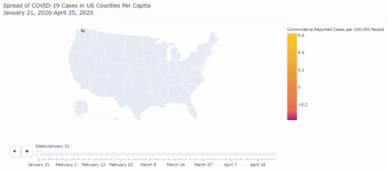
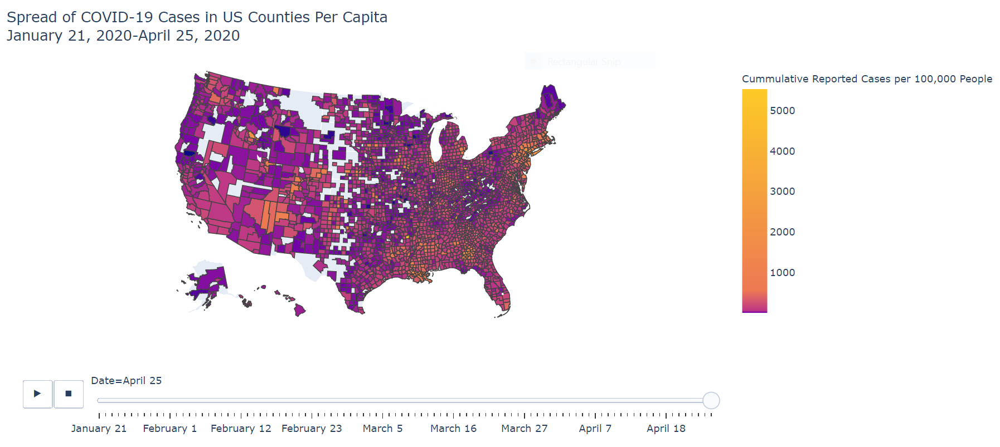

# Analyzing the Spread and Prevalence of COVID-19 Across U.S. Counties

## Business Question
How can we visualize and better understand the overall toll of the COVID-19 pandemic on US counties or county equivalents?

## Data Visualizations: Spread of Coronavirus January 21 - April 25 on Choropleth Maps

### Confirmed Cases Per Capita Data

As of April 25th:

### Raw Confirmed Cases Data

As of April 25th:

## Data Insights
Comparing the choropleth maps made using the number of confirmed cases per county versus confirmed cases per capita per county demonstrates that using the raw data obscures the prevalence of the pandemic in the US. This is because the raw data doesn't account for the population of each county and thereby the relative density of confirmed cases in each county.

Standardizing our data by looking at cases per capita also helps highlight which counties are more likely to risk overloading their health systems with coronavirus patients, which would be useful to government officials and business owners involved in resource diversion and supply chain decisions. Incorporating further data on hospitals and hospital beds per capita would also inform these kinds of decisions. Further data on business closures or unemployment claims would also help illuminate the effect of the pandemic on the US beyond its medical impact.
